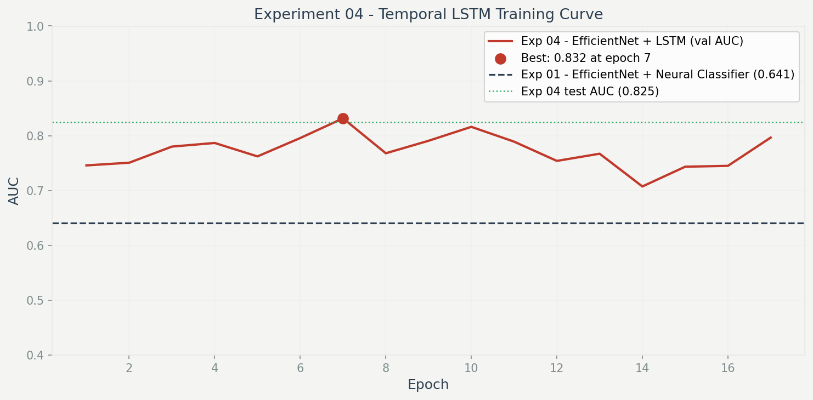

# SigmaMedStat

**Medical device signal reliability intelligence - built for real clinical environments.**

> SigmaMedStat asks: *"Should we trust this sensor reading at all?"*

🔗 **Live demo:** [sigmamedstat.vercel.app](https://sigmamedstat.vercel.app)
💻 **GitHub:** [github.com/Arun-K-Ram/sigmamedstat](https://github.com/Arun-K-Ram/sigmamedstat)

> This is a research project. Not FDA cleared. Not for clinical use.

---

## What This Is

SigmaMedStat is a signal reliability research platform that evaluates the trustworthiness of medical device outputs before any clinical decision is made.

ICU alarm fatigue is a documented crisis. Studies show nurses ignore 85–99% of alarms - not from negligence, but because current systems fire hundreds of false alerts daily. A sensor slips. A patient moves. The monitor screams. Nobody questions whether the device itself can be trusted.

SigmaMedStat does.

---

## The Core Idea

Most medical AI asks: **"What does this signal mean?"**

SigmaMedStat asks: **"Should we believe this signal?"**

It evaluates every alarm against its raw signal data - converting 60 seconds of electrical activity into time-frequency heat maps, extracting features, and determining whether the alarm reflects a real physiological event or a device artifact.

---

## ML Results

Four experiments were run on the **PhysioNet Challenge 2015** dataset - 750 real ICU alarm recordings labeled as true or false alarms by clinicians. 498 records were usable after 4-channel filtering.

| # | Approach | Best Model | Test AUC |
|---|---|---|---|
| 01 | CWT scalograms + pretrained CNN (static) | EfficientNet-B0 + Neural Classifier | 0.641 |
| 02 | 103 hand-crafted signal features | SVM (RBF kernel) | 0.539 |
| 03 | Per-alarm-type classifiers | Tachycardia XGBoost | 0.612 |
| **04** | **CWT scalograms + EfficientNet + LSTM (temporal)** | **EfficientNet-B0 + LSTM** | **0.822 ± 0.016** ★ |

**Experiment 04 won by a significant margin** - +18.1 AUC points over the static baseline. Confirmed statistically significant via DeLong test (z = −3.124, p = 0.0018) and bootstrap 95% CI [0.120, 0.256].

The key insight: splitting each 60-second recording into 6 consecutive 10-second chunks and modeling them as a sequence allowed the LSTM to detect signal degradation patterns over time. A static classifier sees a snapshot. The LSTM sees a story.



---

## How Experiment 04 Works

Raw signal (60s, 4 channels, 250Hz)
↓
Split into 6 × 10-second chunks
↓
CWT scalogram per chunk per channel → (6, 4, 64, 64)
↓
EfficientNet-B0 encodes each chunk → (6, 1280) feature sequence
↓
LSTM(hidden=64, layers=2) learns temporal patterns
↓
Classifier head → false alarm / true alarm probability

---

## Cross-Validation Results

5-fold stratified cross-validation with best config (hidden=64, dropout=0.3, lr=1e-3):

| Fold | AUC |
|---|---|
| Fold 1 | 0.7923 |
| Fold 2 | 0.8254 |
| Fold 3 | 0.8185 |
| Fold 4 | 0.8344 |
| Fold 5 | 0.8373 |
| **Mean** | **0.8216 ± 0.0161** |
| 95% CI | [0.790, 0.853] |

---

## Clinical Metrics

At decision threshold 0.5:

| Metric | Value |
|---|---|
| Sensitivity (Recall) | 0.589 |
| Specificity | 0.847 |
| Precision | 0.641 |
| F1 Score | 0.614 |
| AUC | 0.822 |

---

## Hyperparameter Tuning

A structured one-parameter-at-a-time sweep across 48 training runs. Every result logged and traceable.

### Experiment 01 - EfficientNet + Neural Classifier

| Parameter | Values tested | Winner |
|---|---|---|
| Dropout | 0.2, 0.3, 0.4, 0.5 | **0.5** |
| Hidden layer | 64, 128, 256, 512 | **256** |
| Learning rate | 0.01, 0.001, 0.0001, 0.00001 | **0.0001** |

**Best config:** EfficientNet-B0 · dropout=0.5 · hidden=256 · lr=1e-4

### Experiment 04 - EfficientNet + LSTM

| Parameter | Values tested | Winner |
|---|---|---|
| LSTM hidden | 64, 128, 256, 512 | **64** |
| Dropout | 0.2, 0.3, 0.4, 0.5 | **0.3** |
| Learning rate | 0.01, 0.001, 0.0001, 0.00001 | **0.001** |

**Best config:** EfficientNet-B0 · LSTM hidden=64 · dropout=0.3 · lr=1e-3

---

## Grad-CAM Explainability

Gradient-weighted Class Activation Mapping applied to the best static model to visualize which time periods and frequency bands drove each prediction.

| Record | Alarm type | Ground truth | Model | Correct |
|---|---|---|---|---|
| v100s | Ventricular Flutter | False | TRUE | ✗ |
| v101l | Ventricular Flutter | True | TRUE | ✓ |
| a109l | Asystole | True | TRUE | ✓ |
| b187l | Bradycardia | True | TRUE | ✓ |
| t116s | Tachycardia | False | FALSE | ✓ |
| f120s | Ventricular Fibrillation | False | FALSE | ✓ |

5/6 correct. Images in `frontend/public/gradcam/`.

---

## Error Analysis

| Metric | Value |
|---|---|
| Total errors | 117 (23.5%) |
| False negatives (missed real alarms) | 65 |
| False positives (false alarm called real) | 52 |
| High-confidence errors (>80%) | 85 |

Per-alarm-type AUC:

| Alarm Type | n | AUC | Accuracy |
|---|---|---|---|
| Ventricular Flutter | 263 | 0.820 | 79.5% |
| Bradycardia | 56 | 0.810 | 69.6% |
| Tachycardia | 62 | 0.750 | 71.0% |
| Ventricular Fib. | 32 | 0.733 | 75.0% |
| Asystole | 85 | 0.722 | 76.5% |

---

## System Architecture
Raw Device Signal
↓
Signal Reliability Engine     ← flatlines, spikes, dropouts, noise
↓
Context Correlation Layer     ← neighboring signals, motion, clinical events
↓
Reliability Scorer            ← 0–100 trust score + confidence
↓
Failure Attribution Engine    ← named cause + supporting evidence
↓
Temporal Drift Monitor        ← session degradation tracking
↓
FastAPI → React Dashboard

---

## Core Components

### Signal Reliability Engine
Four statistical detectors running on raw signal windows:

| Detector | Method | Detects |
|---|---|---|
| Flatline | Std deviation + unique value ratio | Sensor disconnection, probe loss |
| Spike | Z-score + derivative analysis | Electrical interference, ADC errors |
| Dropout | NaN detection + zero burst + sudden loss | Cable failure, transmission loss |
| Noise | SNR estimation + sample entropy + variance CV | Motion artifact, EMI, poor contact |

### Context Correlation Layer
- **Multi-signal** - are neighboring signals also degrading simultaneously?
- **Temporal** - is reliability trending down over this session?
- **Clinical events** - did a repositioning or procedure happen recently?
- **Motion** - is accelerometer data showing patient movement?

### Reliability Scorer
Fuses signal quality index (SQI) with context features into a final 0–100 trust score. Context can adjust the score up or down by up to 20 points.

### Failure Attribution Engine
Rule-based expert system that names the probable cause - sensor displacement, motion artifact, device malfunction, environmental interference, or calibration drift.

### Temporal Drift Monitor
Tracks per-session SQI history. Detects gradual degradation using linear regression slope. Predicts time to critical threshold.

---

## Example Output

```json
{
  "trust_score": 24.8,
  "grade": "CRITICAL",
  "recommendation": "reseat_sensor",
  "interpretation": "Signal has flatline - high patient motion - clinical event 10s ago - context reduced trust by 16 points",
  "attribution": {
    "failure_category": "sensor_displacement",
    "confidence": 0.95,
    "primary_cause": "Likely sensor displacement - probe contact lost following patient movement",
    "supporting_evidence": [
      "Flatline detected - signal not responding to patient state",
      "Clinical event 10s ago (repositioning - known artifact cause)",
      "Significant patient motion detected (index 1.00)",
      "Neighboring signals remain stable - isolated sensor issue"
    ],
    "recommended_action": "Physically inspect and reseat the sensor.",
    "likely_false_alarm": true
  },
  "processing_time_ms": 34.32
}
```

---

## Regulatory Awareness

- **IEC 62304** - Class B software safety classification. Modular architecture directly supports unit verification requirements in §5.5
- **ISO 14971** - Risk management documentation. Identified hazards, severity/probability assessment, and control measures documented
- **FDA AI/ML SaMD Action Plan** - Predetermined Change Control Plan for model updates. Algorithm transparency via feature importance

---

## Data

Built on the **PhysioNet Challenge 2015** dataset - *"Reducing False Arrhythmia Alarms in the ICU"*.

- 750 real ICU alarm recordings
- 4 channels: ECG Lead II, ECG Lead V, SpO₂, Respiration
- 250Hz sampling rate, 60-second windows
- Ground truth labels: true alarm / false alarm
- 498 records usable after 4-channel filtering

Freely available at: `physionet.org/content/challenge-2015`

---

## Tech Stack

### ML Pipeline

Python 3.12        Core language
PyTorch 2.0        Deep learning
torchvision 0.15   EfficientNet-B0 pretrained weights
PyWavelets 1.4     Continuous Wavelet Transform
scikit-learn 1.3   SVM, cross-validation, metrics
XGBoost            Hand-crafted feature classifiers
wfdb               PhysioNet signal loading
NumPy / SciPy      Signal processing
matplotlib         Results visualization

### Backend
FastAPI            REST API
Poetry             Dependency management
Pydantic           Request/response schemas
SQLite             Session storage

### Frontend
React + TypeScript  UI framework
Vite               Build tool
React Router       Navigation

---

## Setup

### ML Pipeline

```bash
cd sigmamedstat/ml

# Build static scalogram dataset (Exp 01-03)
python build_dataset.py

# Build temporal dataset (Exp 04)
python build_dataset_temporal.py

# Train Experiment 01
python train.py

# Train Experiment 04 (LSTM sweep)
python train_temporal.py

# Run 5-fold cross-validation
python kfold_temporal.py

# Run ablation study
python ablation_temporal.py

# Run statistical significance test
python stats_test.py
```

### Backend

```bash
cd sigmamedstat/backend
poetry install
poetry run uvicorn api.main:app --reload --host 127.0.0.1 --port 8000
```

### Frontend

```bash
cd sigmamedstat/frontend
npm install
npm run dev
```

Open `http://localhost:5173`

---

## arXiv Preprint

Paper submitted to arXiv - link to be added upon publication.

**Title:** SigmaMedStat: Temporal Signal Modeling for ICU False Alarm Reduction
**Categories:** cs.LG, eess.SP

---

## Why This Problem

Most medical AI predicts diseases, classifies images, or summarizes records.

SigmaMedStat focuses on something different: **can the input data be trusted before any model makes a decision?**

Current hospital monitors were designed in an era before machine learning. They alarm when a reading crosses a threshold - with no understanding of whether that reading is even trustworthy. The result is 350+ alarms per patient per day, 85–99% of which are false positives.

The fix isn't louder alarms or smarter thresholds. It's signal-level intelligence that asks - before the nurse is interrupted - whether this reading should be believed at all.

---

*SigmaMedStat is a research project.*
*Not FDA cleared. Not for clinical use.*